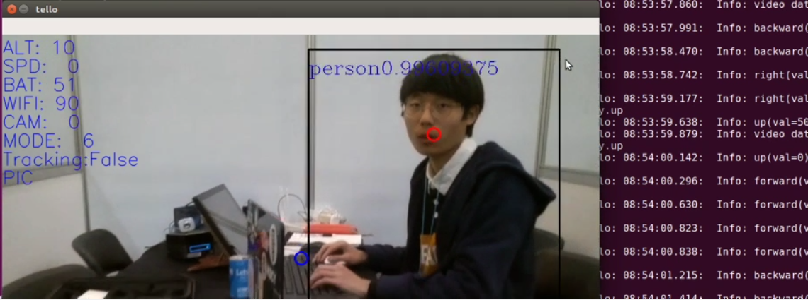
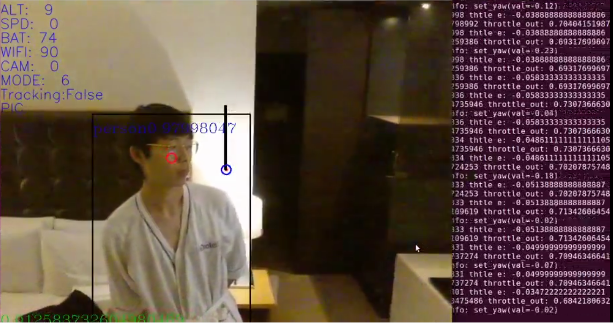

# Autonomously-orbiting-DJI-Tello-drone-around-a-person-using-Neural-Network
**This is a project I worked on during November 26th ~ 17th, 2019. At an AI object tracking hackathon.**

**Example Image 1**

**Example Image 2**

## Code inside this repository is capable of the following:

1. Detecting a human target (that is nearest to the drone camera's center screen) using 'MobileNet' neural network.
2. Track that person while orbiting 'counter-clockwise', with the help of **PID controller**.

***Note! This project uses 'openVINO' inference engine / library. Which is basically a framework developed by Intel, that can optimize models trained in other frameworks (ex. Caffe, Tensorflow) for use on Intel CPU / GPU. Model parameters are already in this Repository, but you'll prbably need to get used to using openVINO if it's your first time.***

## Key Controls (very important! lol):
'w/s/a/d' to control the XY motion

'key up/down/left/right' to control throttle and yaw, respectively.

## Requirements

Python modules : tellopy, numpy, av, cv2, [simple_pid](github.com/m-lundberg/simple-pid), openvino.inference_engine

## How to Run the code:

`python3 telloCV.py`

This will bring up a pop-up screen, and from there, the program will try to connect to the drone itself, make sure WiFi is connected.
When the video can be seen consistently, you're safe to start flying!

## Original Code Source

The code is heavily based on a [telloCV](https://github.com/Ubotica/telloCV) project.
